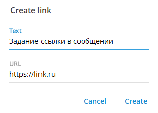

#Форматирование текста сообщения в Telegram
Это пошаговая инструкция о функциональности Telegram
Для того, чтобы отформатировать текст сообщения, выделите текст сообщения целиком или частично и вызовите правой кнопкой мыши контекстное меню. В контекстном меню установите курсор на пункт "Formatting". В данном пункте будут доступны для выбора все опции форматирования текста.
Опции форматирования также можно вызвать грячими клавишами.

Рассмотрим каждую из доступных опций:

1. Для получения жирного шрифта выберите пункт "Formatting/Bold" или сочетание клавиш "Ctrl+B";

**Жирный шрифт в Telegram**
2. Для получения наклонного шрифта (курсива) выберите пункт "Formatting/Italic" или сочетание клавиш "Ctrl+I";

*Курсив в Telegram*
3. Для того, чтобы подчеркнуть выделенный текст выберите пункт "Formatting/Underline" или сочетание клавиш "Ctrl+U";

<u>Подчеркнутый шрифт в Telegram</u>
4. Для того, чтобы зачеркнуть выделенный текст выберите пункт "Formatting/Striketrough" или сочетание клавиш "Ctrl+Shift+X";

~~Зачеркнутый шрифт в Telegram~~
5. Для оформления выделенного текста в виде цитаты выберите пункт "Formatting/Quote" или сочетание клавиш "Ctrl+Shift+";

>Цитата в Telegram
6. Для получения моноширинного шрифта (позволяет другим пользователям копировать написанный текст в буфер обмена, всего лишь кликнув по нему) выберите пункт "Formatting/Monospace" или сочетание клавиш "Ctrl+Shift+M";

##Моноширинный шрифт в Telegram##
7. Для получения скрыттого текста (спойлера) выберите пункт "Formatting/Spoiler" или сочетание клавиш "Ctrl+Shift+P";

Спойлер ||Скрытый шрифт в Telegram||
8. Для получения ссылки выберите пункт "Formatting/Create link" или сочетание клавиш "Ctrl+K". В открывшемся окне <a href="#рис_1">рис.1</a> впишите адрес нужной страницы в поле "URL" и нажмите кнопку "Create".

/// caption
Рисунок 1. Задание ссылки в сообщении
///  

[Ссылка в Telegram](https://link.ru)
9. Для очистки формата выберите пункт "Formatting/Clear formatting" или сочетание клавиш "Ctrl+Shift+N".