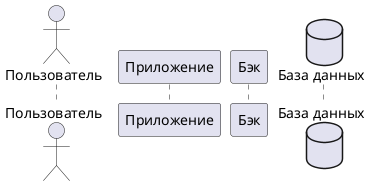
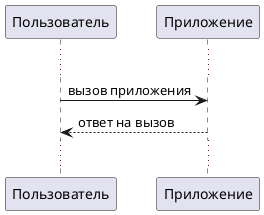
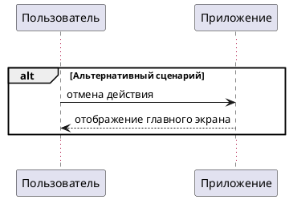

# Добавление диаграмм PlantUML

UML — это стандартизированный язык визуализации, проектирования и документирования программных систем, а также нотификация для создания абстрактных моделей этих систем.

PlantUML — это инструмент, позволяющий создавать диаграммы и схемы с помощью текстового описания.

PlantUML поддерживает создание разных типов диаграмм:

* диаграммы последовательности;
* диаграммы классов;
* диаграммы активностей;
* диаграммы прецедентов;
* диаграммы состояний.

В рамках нашего курса мы рассмотрим разработку диаграммы последовательностей с помощью plantUML.

## Диаграмма последовательности {#sequence-diagram}

Диаграмма последовательности (sequence diagram) показывает взаимодействие между объектами: как, кем и в каком порядке выполняются разные операции. С помощью диаграммы последовательности можно описать любой процесс в системе, например, пользовательский сценарий.

### Синтаксис диаграммы последовательности в PlantUML

!!! info "Важно"
    Код диаграммы в PlantUML заключается в теги:

    ```plantuml
    @startuml
    @enduml
    ```

#### Типы участников

Участники в диаграмме последовательности — это объекты системы, которые принимают участие в описываемом процессе:

* Пользователь — actor
* База данных — database
* Другой объект — participant

Участники объявляются в начале диаграммы в формате `тип_участника Имя_участника`:



На диаграмме участники будут отображаться в порядке их представления.

??? quote "Как это выглядит"
    ```puml
    @startuml
    actor Пользователь
    participant Приложение
    participant Бэк
    database "База данных"
    @enduml
    ```

!!! note "Примечание"
    Если имя участника состоит из двух и более слов, его необходимо указать в кавычках.

#### Описание действий

После представления участников описываются взаимодействия между ними. Мы будем использовать только два типа действия:

* синхронный вызов (`->`);
* ответ на вызов (`<--`).

Взаимодействия двух участников описываются в формате:

* Вызов: `Участник-1 -> Участник-2: Описание вызова`
* Вызов: `Участник-1 <-- Участник-2: Описание ответа`



??? quote "Как это выглядит"
    ```puml
    @startuml
    actor Пользователь
    participant Приложение
    participant Бэк
    database "База данных"

    Пользователь -> Приложение: вызов приложения
    Пользователь <-- Приложение: ответ на вызов
    @enduml
    ```

#### Альтернативные сценарии

Диаграмма последовательности отображает не только успешный сценарий, но и его альтернативные варианты.

Действия альтернативного варианта заключаются в отдельный блок, который создаётся с помощью директивы `opt`:



??? quote "Как это выглядит"
    ```puml
    @startuml
    actor Пользователь
    participant Приложение
    participant Бэк
    database "База данных"

    Пользователь -> Приложение: вызов приложения
    Пользователь <-- Приложение: ответ на вызов

    alt Альтернативный сценарий
    Пользователь -> Приложение: отмена действия
    Пользователь <-- Приложение: отображение главного экрана
    end alt

    @enduml
    ```

Кроме альтернативных сценариев можно собирать и другие блоки:

* `opt` — действия, которые выполняются только при определённом условии;
* `loop` — повторяющиеся циклические вызовы;
* `group` — действия, связанные по смыслу.

## Генерация PlantUML в MkDocs Materials {#plugin}

Для автоматической генерации диаграмм при сборке проекта используйте плагин `mkdocs_puml`:

1. Установите плагин с помощью пакетного менеджера python:

    ```
    pip install mkdocs_puml
    ```

2. Подключите плагин в конфиге проекта:

    ```yaml title="mkdocs.yml"
    plugins:
      - search
      - plantuml:
          puml_url: https://www.plantuml.com/plantuml/
    ```

3. Добавьте в md-файл код plantUML-диаграммы, в блоке кода диаграммы укажите ключевое слово `puml`:

    !!! quote "Пример"
        \`\`\`puml

        @startuml

        @enduml

        \`\`\`

**Результат**: при сборке проекта по тегу на страницу подтянется сгенерированная документация.

## Полезные ссылки

* [PlantUML](https://plantuml.com/ru/){target=_blank};
* [Песочница для plantUML-диаграмм](https://www.plantuml.com/plantuml/uml/){target=_blank};
* Плагин [mkdocs_puml](https://pypi.org/project/mkdocs_puml/){target=_blank};
* [Курс по PlantUML на Stepik](https://stepik.org/course/212663/promo){target=_blank}.


